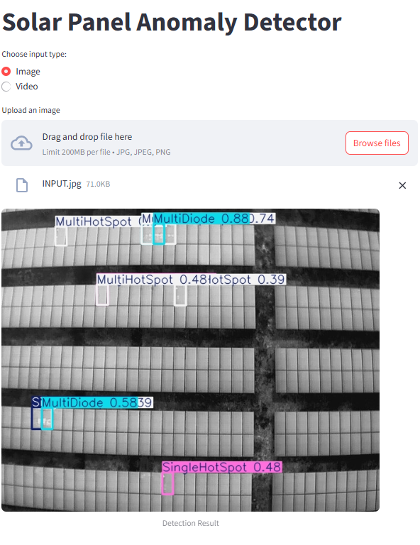

# Thermal-Solar-PV-Anomaly-Detection-
##  Project Overview
This repository hosts a real-time anomaly detection application for photovoltaic (PV) systems, utilizing thermal imagery captured via drones. The application employs the YOLOv8 model for detecting various anomalies in PV modules, providing an efficient and scalable solution for solar panel diagnostics.

##  Key Features

#### Model Training: Trained YOLOv8 model on the ThermoSolar-PV dataset to identify thermal anomalies in PV modules.

#### Streamlit Interface: Developed a local Streamlit application supporting both image and video inputs for real-time anomaly detection.

#### Anomaly Detection: Capable of detecting the following anomalies:

Single Hotspot

Multi Hotspots

Single Diode

Multi Diode

Single Bypassed Substring

Multi Bypassed Substring

String (Open Circuit)

String (Reversed Polarity)

## 🛠️ Technologies Used
#### YOLOv8: For object detection and classification.

#### Streamlit: For building the interactive web application.

#### OpenCV: For image and video processing.

#### Python: Primary programming language.

## Screenshots

### Web App -streamlit

